# 1计算机系统概述

## 冯·诺依曼计算机的特点:

> 1.计算机由五大部件组成
>
> 2.指令和数据以同等地位存于存储器，
>
> 4.可按地址寻访指令和数据用二进制表示
>
> 5.指令由操作码和地址码组成存储程序
>
> 6.以运算器为中心

## “存储程序”的概念

> 是指将指令以二进制代码的形式事先输入计算机的主存储器，
>
> 然后按其在存储器中的首地址执行程序的第一条指令，
>
> 以后就按该程序的规定顺序执行其他指令，直至程序执行结束。


## 程序编译过程


## 计算机性能指标

#### cpu性能指标

> `ips`表示速度
>
> `MIPS`要除$10^{6}$ 


#### MIPS和CPI计算公式

$$
MIPS = 指令数/(执行时间*10^{6})\\
MIPS = 主频/(CPI*10^{6})\\
CPI = 每条指令的平均时钟周期数
$$


> [MIPS计算公式总结_mips怎么计算-CSDN博客](https://blog.csdn.net/qq_38608642/article/details/90138085)

指令的复杂程度会影响平均指令执行速度

#### 整体性能指标


#### 常见单位换算

$$
秒\space\space1s = 10^{3} ms
= 10^{6} us
= 10^{9} ns
= 10^{12} ps
$$

$$
频率\space\space1 kHz = 10^{3}Hz \space \space1 MHz = = 10^{6}Hz\\
1 GHz = 10^{9}Hz \space \space1 THz = 10^{12}Hz\\
1 PHz = 10^{15}Hz\space \space1 EHz = 10^{18}Hz\\
$$


## 计算机系统层次结构


#### 存储程序过程


#### 存储有关概念


#### 冯诺依曼机


#### 计算机软件总结


#### 计算机系统分类


#### 计算机硬件基本组成


#### 解释程序和编译程序区别


#### 控制器运算器分类


#### 逻辑等价


#### 位数字长


# 2.数据表示和运算

#### 原，反，补，移

>反，原基础上除符号位取反，
>
>补，反码基础上加1
>
>移码，把补码的符号位取反，其他位不变，加上2的n-1次幂

#### 0的个数

>补码，移码，一个0，补`0000`，移码`1000`
>
>原码，反码，两个0，原`0000`，`1000`，反`0000`，`1111`

#### 变补

>$\left [ -x\right ]补,为\left [ x\right ]补，各位取反再加1，连通符号位$

>补码为n位，那么变补就是$2^{n}-x,x表示真实值$

#### 各种码的范围（n+1）位


#### 补码大小

`对于补码整数来说`，负数1越多真实值越大，，正数1越多越大


#### 算数移动

>原码的算数移位--符号位保持不变，仅对数值位进行移位
>
> 


#### 变形补码

使用双符号位的补码

#### 浮点数运算溢出判断根据阶码是否溢出

#### 定点数没有舍入概念

#### 浮点数舍入两种情况：对阶，右规规格化

#### IEEE754减偏置值


# 3 存储系统

## 3.1-存储器概述


## 3.2-主存储器


## 3.3 主存储器和cpu的连接

#### 多体交叉存储器

##### 低位

$$
T:存储时间 n:任务个数 r:启动时间\\
1次流水线总耗时=T+(n-1)r\\
连续m次流水线总耗时=mT+(n-1)r
$$

##### 高位

$$
1次流水线总耗时=nT\\
$$


#### 存储容量

>**$存储容量=个数*长度$**
>
>**$存储容量=寻址单元个数*每个寻址单元容量$**
>
>**$存储容量=寻址单元个数*存储字长$**
>
>例如：$16K*8bit$ 的存储芯片
>
>存储容量为$128Kb，16KB$，
>
>$16K表示$寻址单元个数，$8bit表示$每个寻址单元容量

#### 字，位扩展

>**字扩展**表示**寻址单元个数**成倍增加
>
>**位扩展**表示**每个寻址单元容量**成倍增加
>
>
>
>例如：4个 $16K*8bit$​ 的存储芯片
>
>**字扩展**为 $64K*8bit$，$64K*1B$
>
>**位扩展**为 $16K*32bit$，$16K*4B$
>
>**字位扩展**为 $32K*16bit$，$32K*2B$
>
>由于字，位只能**成倍增加**，故4只能有三种组合 $1*4$ , $4*1$ , $2*2$

#### 译码器片选法

>$K$表示**地址线个数**，$bit$表示**数据线个数**
>
>**位扩展**增加**数据线个数**
>
>**字扩展**不增加**地址线个数**，增加**片选线个数**
>
>
>
>例如:
>
>​	用$4K*4bit$的芯片组成$16KB$的存储器，
>
>​	怎么分配地址总线$A_{0}(高位)到A_{15}(低位)$
>
>解答：
>
>​	16\*8 ,4*4，需要字扩展4倍，位扩展2倍
>
>​	**位扩展2倍**,意思是两个芯片组合为一个芯片，从4bit到8bit
>
>​	**字扩展4倍,**意思是四个组合后的芯片并联
>
>​	**地址线个数**，4K表示有12个地址线
>
>​	**数据线个数**，8bit表示8个数据线
>
>​	**片选线个数** ，**四个组合芯片**，表示要能选四个，由二进制，2个片选线
>
>​	一般来说，地址总线从低位到高位使用，**先地址线，再片选线**，
>
>​	$D_{0}到D_{7}为数据线，A_{15}到A_{4}为地址线,A_{3}到							A_{2}为片选线，A_{1}到A_{0}保留$​
>
>

## 3.4 -外部存储器-磁盘

#### 1 .磁盘设备的组成

磁头数 (Heads)即记录面数，表示硬盘总共有多少个磁头，磁头用于读取/写入盘片上记录面的信息，一个记录面对应一个磁头。

柱面数 (Cylinders)表示硬盘每一面盘片上有多少条磁道。在一个盘组中，不同记录面的相同编号（位置）的诸磁道构成一个圆柱面。

扇区数（ Sectors ）表示每一条磁道上有多少个扇区。

#### 2 .磁盘的性能指标

**磁盘的容量：**一个磁盘所能存储的字节总数称为磁盘容量。磁盘容量有非格式化容量和格式化容量之分。非格式化容量是指磁记录表面可以利用的磁化单元总数。格式化容量是指按照某种特定的记录格式所能存储信息的总量。

**记录密度：**记录密度是指盘片单位面积上记录的二进制的信息量，通常以道密度、位密度和面密度表示。道密度是沿磁盘半径方向单位长度上的磁道数；位密度是磁道单位长度上能记录的二进制代码位数；面密度是位密度和道密度的乘积。

**平均存取时间：**=寻道时间（磁头移动到目的磁道）+旋转延迟时间（磁头定位到所在扇区）+传输时间（传输数据所花费的时间）
$$
寻道时间 = 题目直接给\\
旋转延迟时间 = \frac{一圈的时间}{2}\\
(一个扇区)传输时间 = \frac{一圈的时间}{一个盘面的扇区个数}
$$


**数据传输率：**磁盘存储器在单位时间内向主机传送数据的字节数，称为数据传输率。

3 .磁盘地址

4 ．硬盘的工作过程

## 3.5-高速缓冲寄存器

#### 替换位

>对于**直接映射**，主存中的每一块只能装入 Cache 中的唯一位置，若产生块冲突，原来的块将被无条件换出，因此**无须考虑替换问题**，
>
>而**组相联映射**和**全相联映射**都需要**考虑替换问题**。先进先出算法需要对每个 Cache 行打一个时间戳，记录何时装入了一个新主存块。

#### cache与主存的映射方式

>[全网最细！Cache主存全相联、直接、组相联映射问题通解_哔哩哔哩_bilibili](https://www.bilibili.com/video/BV1JP411m7k3/?spm_id_from=333.337.search-card.all.click&vd_source=81d07727a431bd6b2d07b94e67a294fc)

>**直接映射** :主存物理地址=标记+cache 行号 + 块内地址
>	**全相联映射**:主存物理地址=标记+块内地址
>	**组相联映射**:主存物理地址 =标记+组号+块内地址
>
>`注释：均省略两字-位数`
>
>n路组相联映射每n个Cache行为一组

>**cache的容量**=**cache的大小**=一行的位数*cache行数

>**Q1:块内地址位数怎么求？**
>
>​	若按字节编址
>$$
>块内地址的位数=log_{2}{\frac{cache块(cache行)一行的位数}{8}}
>$$
>**Q2:直接相联映射cache行的位数怎么求？**
>$$
>\text直接相联映射的cache行数=log_{2}{\frac{cache的容量}{(cache块一行的位数)}}
>$$
>**Q3:组相联映射的组号位数怎么求？**
>
>​	若以 $k$ 路进行组相联映射
>$$
>\text组相联映射的组号=log_{2}{\frac{cache的容量}{k*(cache块一行的位数)}}
>$$
>**Q4:标记位数怎么求？**
>
>​	无论三种映射方式哪一种，都是统一的
>$$
>标记位数=(主存物理地址位数)-(块内地址)-(cache行号)-(组号)\\
>省略位数二字\\
>标记位数=\frac{主存容量}{Cache容量}
>$$
>
>
>**Q5:组相联映射的组号和主存块号对应关系**
>$$
>Cache组号 = 主存块号 \% Cache组的个数
>$$
>**Q6:Cache 行号与主存块号对应关系**
>$$
>Cache行号 = 主存块号 \% Cache总行数
>$$
>**Q7:Cache一行所存储的内容**
>$$
>有效位+脏位+替换算法位+标记位+Cache一行数据大小
>$$
>`索引数：直接相联的cache行数 or 组相联组号位数`
>
>`块内偏移:块内地址位数`
>
>**Q8:主存块号**
>$$
>主存块号=标记位+索引数
>$$
>**Q8:Cache地址**
>$$
>Cache地址=索引数+块内偏移
>$$
>**Q9：地址映射表**
>$$
>地址映射表大小=Cache行*(有效位+脏位+替换算法位+标记位)
>$$
>

## 3.6-虚拟存储器

虚地址实地址细分


### 定义

> 虚拟存储器将主存或辅存地址空间统一编制
>
> 主存和辅存在硬件和操作系统下共同管理

### 虚拟地址和实际地址定义

>用户编程允许涉及的地址成为**虚地址/逻辑地址**
>
>虚地址对应**虚拟空间**
>
>实际主存地址称为**实地址**/**物理地址**
>
>实地址对应**主存地址空间**
>
>一般来说是虚地址大于实地址

### 虚拟地址和实际地址转化

>1. CPU 使用虚地址时，先判断这个虚地址对应的内容是否已装入主存。
>2. 若已在主存中，则通过地址变换，CPU可直接访问主存指示的实际单元
>3. 若不在主存中，则把包含这个字的一页或一段调入主存后再由 CPU访问。
>4. 若主存已满，则采用替换算法置换主存中的交换块(页面)。
>5. 

>连续地址转化：
>
>
>
>分页地址转换： 
>
>
>
>页号 = 逻辑地址 / 页面长度 （取除法的整数部分） 
>
>页内偏移量 = 逻辑地址 % 页面长度（取除法的余数部分）

### 分页的基本地址变换机构

>1. **基本地址变换机构**可以借助进程的页表将**逻辑地址**转换为**物理地址**。 
>
>2. 通常会在系统中设置一个**页表寄存器(PTR)**,存放页表在内存中的**起始地址F 和页表长度M**。 
>
>3. 进程未执行时，**页表的始址 和 页表长度** 放在进程控制块（PCB）中，
>
>   当进程被调度时，操作系统内核会把它们放到**页表寄存器**中。
>
>   
>
>   

>`例：若页面大小L 为 1K 字节，页号2对应的内存块号 b = 8，将逻辑地址 A=2500 转换为物理地址E。 `
>
>`等价描述：某系统按字节寻址，逻辑地址结构中，页内偏移量占10位，页号2对应的内存块号 b = 8， 将逻辑地址 A=2500 转换为物理地址E。 `
>
>说明一个页面的大小 为 210 B = 1KB 
>
>①计算页号、页内偏移量 页号P = A/L = 2500/1024 = 2； 页内偏移量 W = A%L = 2500%1024 = 452 
>
>②根据题中条件可知，页号2没有越界，其存放的内存块号 b = 8 
>
>③物理地址 E = b * L + W = 8 * 1024 + 425 = 8644 
>
>在分页存储管理（页式管理）的系统中，只要确定了每个页面的大小，逻辑地址结构就确定了。因此，**页式管理中地址是一维的**。即，只要给出一个逻辑地址，系统就可以**自动地算出页号**、**页内偏移量两个部分**，并不需要显式地告诉系统这个逻辑地址中，页内偏移量占多少位

### 分页的快表地址变换机构

#### 快表定义

>快表用 SRAM 实现，其工作原理类似于 Cache，通常采用全相联或组相联映射方式。TLB 表项由页表表项内容和 TLB 标记组成。全相联映射下，TLB 标记就是对应页表项的虚拟页号;组相联方式下，TLB标记则是对应虚拟页号的高位部分，而虚拟页号的低位部分作为TLB组的组号。
>
>`访问过程`
>
>① CPU给出逻辑地址，由某个硬件算得页号、页内偏移量，将页号与快表中的所有页号进行比较。 
>
>② 如果找到匹配的页号，说明要访问的页表项在快表中有副本，则直接从中取出该页对应的内存块号，再将内存块号与页内偏移量拼接形成物理地址，最后，访问该物理地址对应的内存单元。因此， 若快表命中，则访问某个逻辑地址仅需一次访存即可。
>
>③ 如果没有找到匹配的页号，则需要访问内存中的页表，找到对应页表项，得到页面存放的内存块 号，再将内存块号与页内偏移量拼接形成物理地址，最后，访问该物理地址对应的内存单元。
>
> 因此， 若快表未命中，则访问某个逻辑地址需要两次访存（注意：在找到页表项后，应同时将其存入快表， 以便后面可能的再次访问。但若快表已满，则必须按照一定的算法对旧的页表项进行替换） 由于查询快表的速度比查询页表的速度快很多，因此只要快表命中，就可以节省很多时间。 因为局部性原理，一般来说快表的命中率可以达到 90% 以上。
>
>
>
>

#### 基本地址变换与具有快表的对比

>

`缺页中断`

>
> 
>
>

### 多级页表的地址变换机构

#### `单级页表出现的问题`

>
>
>
>
>`问题一：页表必须连续存放，因此当页表很大时，需要占用很多个连续的页框。`
>
>解决措施：把页表再分页并离散存储，然后再建立一张页表记录页表各个部分 的存放位置，称为页目录表，或称外层页表，或称顶层页表
>
> `问题二：没有必要让整个页表常驻内存，因为进程在一段时间内可能只需要访问某几个特定的页面。`
>
>解决措施：可以在需要访问页面时才把页面调入内存（虚拟存储技术）。可以 在页表项中增加一个标志位，用于表示该页面是否已经调入内，若想访问的页面不在内存中，则 产生缺页中断（内中断/异常）， 然后将目标页面从外存调入内存

#### `二级页表`

>
>
>`注意几个术语:页目录表/外层页表/顶级页表`

#### `最多有几级页表`

>
>
>- 多级页表中，各级页表的大小不能超过一个页面。若两级页表不够，可以分更多级
>- 多级页表的访存次数(假设没有快表机构)--N 级页表访问一个逻辑地址需要 N+1次访存

### 段式地址变换机构

>① 从逻辑地址 A 中取出前几位为段号 S，后几位为段内偏移量 W。
>②判断段号是否越界，
>
>​	$若段号 S>段表长度 M，则产生越界中断，否则继续执行。$
>
>③ 在段表中查询段号对应的段表项，
>
>$段号S对应的段表项地址=段表始址F+段号S * 段表项长度.\\取出段表项中该段的段长C，若W≥C，则产生越界中断，否则继续		执行。$
>
>④ 取出段表项中该段的始址 b，计算物理地址 E=b+W，用物理地址E去访存。
>
>
>
>
>

### 虚拟存储器使用的技术

>1. 全相联映射
>2. 每个虚页面可以存放到对应主存区域的任何一个空闲页位置
>3. 采用回写法，因为进行写操作时，不能每次都能同时写回磁盘，一致性问题

#### 页式虚拟存储

##### 定义

>**主存空间**和**虚拟地址空间**都被划分为**相同大小的页**
>
>**页式虚拟存储器**以**页**为基本单位

> - **主存空间**的页称为**物理页**，实页，**页框**
>
> - **虚拟地址**的页称为虚拟页，**虚页**
>
> - **进程的块**就是**页**，**内存的块**就是**框**
>
> - 页框=页帧=内存块=物理块=物理页面

>- 操作系统**以页框为单位**为各个进程分配内存空间。
>
>- 进程的每个**页面**分别放入一个**页框**中。
>
>- 也就是说,进程的**页面**与内存的**页框**有一一对应的关系
>
>- 各个**页面不必连续存放**，可以放到不相邻的各个页框中

##### 页表作用和位置

>- 为了能知道进程的每个页面在内存中存放的位置，
>
>  操作系统要为每个进程建立一张页表。
>
>- 记录了程序的虚页调入主存时，所在主存的位置
>- 页表一般长久地保存在内存中

##### 页表的内容

>$$
>有效位+脏位+引用位(使用位)+物理页(磁盘地址)
>$$
>
>有效位/装入位:对应的页面是否在主存
>
>脏位/修改位:用来表示页面是否被修改过
>
>引用位/使用位:用来配合替换策略进行设置，用哪种替换策略

>1. 一个进程对应一张页表 
>2.  进程的每个页面对应一个页表项 
>3.  每个页表项由“页号”和“块号”组成 
>4.  页表记录进程页面和实际存放的内存块之间的映射关系 
>5.  每个页表项的长度是相同的

##### 页表项定义

>进程的一个页面对应一个页表项
>
>每个页表项由 页号+块号 组成

##### 每个页表项占多少字节？

>假设某系统物理内存大小为 4GB，页面大小为 4KB，则 每个页表项至少应该为多少字节？ 
>
>$内存块大小=页面大小=4KB= 2^{12} B$
>
>$4GB 的内存总共会被分为 2^{32} / 2^{12} = 220个内存块 $
>
>$内存块号的范围应该是 0 \sim 2^{20} -1 $
>
>内存块号至少要用 20 bit 来表示 
>
>至少要用3B来表示块号（3*8=24bit）
>
>$由于页号是隐含的，因此每个页表项占3B，存储整个页表至少需要 3*(n+1)B$
>$$
>一个页表项的位数=log_{2}{\frac{物理内存大小}{页面大小*8}}
>$$
>

>注意：
>
>1. 页表记录的只是内存块号，而不是内存块的起始地址！
>2. J 号内存块的起始地址 = J * 内存块大小
>3. 每个页表项的长度是相同的，各页表项会按顺序连续地存放在内存中，页号是“隐含”的
>4. 
>5. 分页通过硬件机制实现，对用户完全透明。


#### 段式虚拟存储

##### 定义

>- 按照程序自身的逻辑关系划分为若干个段,每段从0开始编址
>
>- 每个段在内存中占据连续空间，但各段之间可以不相邻。
>
>- 用户编程更方便，程序的可读性更高
>- 
>- 

##### 段表的内容

>1. 需为每个进程建立一张段映射表，简称“段表”
>2. 每个段对应一个段表项，其中记录了该段在内存中的起始位置（又称 “基址”）和段的长度。
>3. 

>`例如：某系统按字节寻址，采用分段存储管理，逻辑地址结构为（段号16位, 段内地址16位）`
>
>- 因此用16位 即可表示最大段长。物理内存大小为4GB（可用32位表示整个物理内 存地址空间）。
>
>- 因此，可以让每个段表项占 16+32 = 48位，即6B。
>
>- 由于段表项长度相同，因此段号可以是隐含的，不占存储空间。
>
>- 若段表 存放的起始地址为 M，则 K号段对应的段表项存放的地址为 M + K*6

##### 分段和分页对比/分段存储的优点

>
>
>
>
>

### 页框分配

#### 页面分配、置换策略

**驻留集**：指请求分页存储管理中给进程分配的物理块的集合。**固定分配：**操作系统为每个进程分配一组固定数目的物理块，在进程运行期间不再改变。即，驻留集大小不变

**可变分配：**先为每个进程分配一定数目的物理块，在进程运行期间，可根据情况做适当的增加或减少。即，驻留集大小可变

**局部置换：**发生缺页时只能选进程自己的物理块进行置换。

**全局置换：**可以将操作系统保留的空闲物理块分配给缺页进程，也可以将别的进程持有的物理块置换到外存，再分配给缺页进程。


#### 何时调入页面

1. 预调页策略：根据局部性原理，一次调入若干个相邻的页面可能比一次调入一个页面更高效。故这种策略主要用于进程的首次调入，

2. 请求调页策略：进程在运行期间发现缺页时才将所缺页面调入内存。

#### 从何处调入页面


#### 抖动或颠簸

刚刚换出的页面马上又要换入内存，刚刚换入的页面马上又要换出外存，这种频繁的页面调度行为。产生抖动的主要原因是进程频繁访问的页面数目高于可用的物理块数（分配给进程的物理块不够）

#### 工作集

1. **工作集：**指在某段时间间隔里，进程实际访问页面的集合。
2. 一般来说，驻留集大小不能小于工作集大小，否则进程运行过程中将频繁缺页。

### 内存映射文件

#### 特性

1. 进程可使用系统调用，请求操作系统将文件映射到进程的虚拟地址空间
2. 以访问内存的方式读写文件
3. 进程关闭文件时，操作系统负责将文件数据写回磁盘，并解除内存映射
4. 多个进程可以映射同一个文件，方便共享

#### 优点

1. 程序员编程更简单，已建立映射的文件，只需按访问内存的方式读写即可
2. 文件数据的读入/写出完全由操作系统负责，I/O 效率可以由操作系统负责优化

# 4指令系统

### 4.1指令系统

#### MIPS寄存器约定

>

#### MIPS机器语言

>
>
>跳转指令
>
>
>
>分支指令
>
>

MIPS常见操作码

>1. **R-type指令（寄存器-寄存器操作）**：
>   - `add`：000000（opcode），表示将两个寄存器的值相加。
>   - `sub`：000000，表示将一个寄存器的值减去另一个寄存器的值。
>   - `and`：000000，表示对两个寄存器的值进行逻辑与操作。
>   - `or`：000000，表示对两个寄存器的值进行逻辑或操作。
>2. **I-type指令（立即数操作）**：
>   - `addi`：001000，表示将一个立即数加到一个寄存器的值。
>   - `lw`：100011，表示将一个字加载到寄存器中。
>   - `sw`：101011，表示将寄存器中的值存储到内存中的一个字。
>3. **J-type指令（跳转操作）**：
>   - `j`：000010，表示无条件跳转到指定地址。
>   - `jal`：000011，表示跳转并保存返回地址。

#### 1 机器语言有很多种，问 gpt得到答案

>1. **x86/x64机器语言**：x86/x64架构是目前个人计算机和服务器中最常见的架构之一。它们使用的机器语言是基于Intel的x86指令集，包括指令如MOV（数据传输）、ADD（加法运算）、SUB（减法运算）等等。
>2. **ARM机器语言**：ARM架构是一种在移动设备、嵌入式系统和超级计算机等广泛应用的架构。它使用的机器语言基于ARM指令集，包括指令如MOV（数据传输）、ADD（加法运算）、SUB（减法运算）等等。
>3. **MIPS机器语言**：MIPS（Microprocessor without Interlocked Pipeline Stages）是一种常见的RISC（Reduced Instruction Set Computing）架构。它使用的机器语言基于MIPS指令集，包括指令如ADD（加法运算）、SUB（减法运算）、LW（加载字）、SW（存储字）等等。
>4. **SPARC机器语言**：SPARC（Scalable Processor Architecture）是由Sun Microsystems开发的一种RISC架构。它使用的机器语言基于SPARC指令集，包括指令如ADD（加法运算）、SUB（减法运算）、LD（加载数据）、ST（存储数据）等等。
>
>

#### 2 isa规定了每条指令的控制信号,这个结论是错误的

>您是正确的，我深表歉意。ISA（Instruction Set Architecture，指令集架构）确实规定了指令集的结构和操作，但它通常不直接规定控制信号。ISA通常是更高层次的抽象，它规定了程序员能够使用的指令集合、指令的格式、操作类型等，而不涉及具体的硬件实现细节，例如控制信号的生成和传递。
>
>控制信号是由处理器的微架构来实现的，微架构是指处理器的内部设计和实现细节，包括指令解码、执行单元、寄存器文件等。微架构根据ISA中规定的指令集的要求来设计，以及处理器的设计目标，生成和使用适当的控制信号。因此，控制信号是由处理器的设计者根据ISA的规范和设计目标来定义和实现的。


#### 3 RISC下的转移指令

>RISC架构通常采用简单的转移指令来实现控制流的改变。这些指令通常是无条件转移和条件转移指令。
>
>1. **无条件转移指令**：
>     无条件转移指令会在不考虑任何条件的情况下直接转移到目标地址。在RISC架构中，通常使用类似于"JUMP"（跳转）的指令来实现无条件转移。例如，考虑以下的RISC汇编指令：
>
>   ```assembly
>   JUMP label
>   ```
>
>   这条指令会无条件地跳转到标记为"label"的代码位置。
>
>2. **条件转移指令**：
>     条件转移指令会根据某些条件来判断是否进行转移。在RISC架构中，条件转移指令通常使用类似于"BRANCH"（分支）的指令来实现。例如，考虑以下的RISC汇编指令：
>
>   ```assembly
>   BRANCH condition, label
>   ```
>
>   这条指令会根据条件"condition"来判断是否转移到标记为"label"的代码位置。如果条件满足，则执行跳转操作，否则继续顺序执行下一条指令。
>
>在RISC架构中，转移指令通常都是简单且直接的，这有助于提高处理器的性能和流水线的效率。通过这些转移指令，程序可以实现各种不同的控制流程，包括循环、条件分支、函数调用等。


#### 4 isa指令集体系结构，所规定内容是什么

>ISA（指令集体系结构）是计算机体系结构中的一个重要组成部分，它定义了一套指令，这些指令指明了计算机能够执行的操作，以及如何执行这些操作。ISA涵盖的内容包括：
>
>1. **指令集**：包括所有的机器语言指令，如数据传输、算术逻辑运算、控制指令等。
>2. **数据类型**：定义了计算机系统中可以处理的数据种类，比如整型、浮点数、字符串等。
>3. **寄存器集**：指明了CPU内的寄存器数量及其用途，包括通用寄存器和专用寄存器（如程序计数器PC、状态寄存器等）。
>4. **寻址模式**：定义了指令中的操作数可以如何寻址，即确定数据的位置的方法，包括直接寻址、间接寻址、基址寻址、立即寻址等。
>5. **指令格式**：指令的布局或结构，如操作码（opcode）和操作数等部分的组织方式。
>6. **异常和中断处理**：定义了在执行指令过程中，如何处理异常情况（如除0错误、访问违规内存等）和外部中断请求（如I/O操作完成、外部信号等）。
>
>ISA作为硬件（如CPU设计）和软件（如编译器设计、操作系统）之间的桥梁，对两者都有深远的影响。它决定了软件如何控制硬件，以及硬件如何理解和执行软件的指令。不同的计算机体系结构会有不同的ISA，比如x86、ARM、MIPS等，每种ISA都有其特点和应用领域。
>
>

#### 5 那他就是一段文字内容了，然后硬件根据这个规则设计电路？

> 是的，你的理解是正确的。ISA（指令集体系结构）基本上是一段详细的文档或规范，描述了计算机处理器能理解和执行的指令集，以及这些指令如何操作计算机的内存和寄存器。硬件设计师根据这个规范来设计和实现具体的硬件电路，确保硬件能够正确地理解和执行符合该ISA的软件指令。
>
> 这个过程包括：
>
> 1. **指令实现**：硬件设计师会确保处理器的物理电路能够识别ISA中定义的每条指令的唯一代码（操作码），并执行相应的操作。
> 2. **数据处理**：ISA中规定的数据类型和操作需要在硬件层面上得到支持，设计师会实现相应的逻辑电路来处理这些数据。
> 3. **寄存器设计**：ISA定义了一系列的寄存器，包括它们的用途和操作方式。硬件中必须包含这些寄存器的物理实现。
> 4. **寻址模式**：硬件必须能够支持ISA定义的所有寻址模式，设计师需要确保处理器能够按照这些规则来访问内存地址。
>
> 因此，ISA在软件和硬件设计中起着桥梁的作用，使得软件开发者能够通过编写符合ISA的指令代码来控制硬件行为，而不需要知道硬件的具体实现细节。同样，硬件设计师在明确了ISA的要求后，可以自由地设计出满足这些要求的电路，不同的硬件实现可以有不同的性能特点，但都能运行同样的指令集。


### 4.2指令的寻址方式


#### 1 寄存器寻址是如何缩短地址字段的，举个例子

> 在RISC架构中，寄存器寻址通过直接引用寄存器来访问数据，而不是通过内存地址。这样做可以大大减少指令中的地址字段的长度，因为不需要指定内存地址，而是直接操作寄存器。这里是一个简单的示例：
>
> 假设我们有一条RISC指令，要求将寄存器R1中的值加到寄存器R2中，然后将结果存储到寄存器R3中。
>
> ```less
> ADD R3, R1, R2
> ```
>
> 在这个例子中，指令不需要指定任何内存地址，而是直接引用了寄存器R1、R2和R3。因此，指令中不需要包含任何地址字段，只需要操作码和寄存器标识符即可。这种方式大大减少了指令的长度，提高了指令执行的效率。


#### 2 用`risc`表示，举一个相对寻址的例子

> 在RISC架构中，相对寻址通常通过使用分支指令来实现。这里是一个使用RISC指令集的相对寻址的简单示例：
>
> 假设我们有一段RISC指令集的程序，它位于内存地址的起始位置，我们希望在程序执行过程中跳转到程序中的另一个位置。
>
> 在RISC指令集中，可能会有一个分支指令，比如 `BEQ`（Branch if Equal），它可以根据某些条件执行跳转操作。
>
> 示例代码：
>
> ```less
> LOAD R1, [100]      ; 从内存地址100处加载数据到寄存器R1中
> ADD R1, R1, #1      ; R1 = R1 + 1
> CMP R1, #10         ; 比较寄存器R1中的值与10
> BEQ 500             ; 如果R1等于10，则跳转到内存地址500处
> ```
>
> 在这个例子中，如果寄存器R1中的值等于10，那么程序会跳转到内存地址500处继续执行，否则会继续执行下一条指令。这里的相对寻址是相对于当前指令的地址偏移量，而不是直接指定目标地址，因此可以实现相对寻址的效果。


#### 3 其他寻址方式例子

> 明白了，下面我将给出完整的指令格式，并举例说明各种寻址方式的应用：
>
> 假设我们有一个RISC架构，指令格式如下：
>
> ```
> [操作码] [寄存器1] [寄存器2] [立即数/地址]
> ```
>
> 1. 直接寻址：
>
> ```
> LOAD R1, [100]   
> ```
>
> 这条指令的操作码是LOAD，寄存器1是R1，寻址特征表明是直接寻址，地址字段为100，表示要将内存地址100处的数据加载到寄存器R1中。
>
> 2. 寄存器寻址：
>
> ```
> ADD R3, R1, R2 
> ```
>
> 这条指令的操作码是ADD，寄存器1是R1，寄存器2是R2，寻址特征表明是寄存器寻址，没有地址字段，因为操作数直接来自寄存器R1和R2。
>
> 3. 相对寻址：
>
> ```
> JUMP_RELATIVE 500  
> ```
>
> 这条指令的操作码是JUMP_RELATIVE，寻址特征表明是相对寻址，地址字段为500，表示要跳转到相对于当前指令地址偏移量为500的位置执行程序。
>
> 4. 基址寻址：
>
> ```
> LOAD R1, [R2 + 100]   
> ```
>
> 这条指令的操作码是LOAD，寄存器1是R1，寄存器2是R2，寻址特征表明是基址寻址，地址字段为100，表示要将基址寄存器R2中的值加上100，然后从该地址处加载数据到寄存器R1中。
>
> 5. 变址寻址：
>
> ```
> LOAD R1, [R2 + R3]   
> ```
>
> 这条指令的操作码是LOAD，寄存器1是R1，寄存器2是R2，寄存器3是R3，寻址特征表明是变址寻址，没有具体的地址字段，表示要将基址寄存器R2中的值加上变址寄存器R3中的值，然后从该地址处加载数据到寄存器R1中。
>
> 6. 堆栈寻址：
>
> ```
> PUSH R1   
> ```
>
> 这条指令的操作码是PUSH，寄存器1是R1，寻址特征表明是堆栈寻址，没有地址字段，表示要将寄存器R1中的值压入堆栈中。
>
> 7. 隐含寻址：
>
> ```
> HALT   
> ```
>
> 1. 直接寻址：
>
> ```
> LOAD R1, 100   ; 将内存地址100处的数据加载到寄存器R1中
> ```
>
> 2. 寄存器寻址：
>
> ```
> ADD R3, R1, R2 ; 将寄存器R1和R2中的数据相加，结果存储到寄存器R3中
> ```
>
> 3. 相对寻址：
>
> ```less
> JUMP_RELATIVE 500  ; 跳转到相对于当前指令地址的偏移量为500的位置执行程序
> ```
>
> 4. 间接寻址：
>
> ```less
> LOAD R1, [R2]  ; 将寄存器R2中的地址所指向的数据加载到寄存器R1中
> ```
>

#### 4 用相对寻址实现程序浮动

>使用相对寻址可以实现程序中的分支和循环结构，从而实现程序的流动。下面是一个简单的示例，演示如何使用相对寻址来实现程序的流动。
>
>假设我们有一个简单的程序，其功能是将一个数组中的所有元素相加，并将结果存储在一个寄存器中。程序如下：
>
>```less
>LOAD R1, array_start    ; 加载数组起始地址到寄存器R1
>LOAD R2, array_end      ; 加载数组结束地址到寄存器R2
>CLEAR R3                ; 清空寄存器R3，用于存储累加结果
>
>loop_start:
>    LOAD R4, [R1]       ; 加载当前数组元素到寄存器R4
>    ADD R3, R3, R4      ; 累加结果到寄存器R3
>    ADD R1, R1, #1      ; 移动到下一个数组元素
>
>    CMP R1, R2          ; 比较当前数组元素是否已经到达数组结束位置
>    BNE loop_start      ; 如果未到达数组结束位置，则跳转到循环开始处继续执行
>
>    HALT                ; 停止执行程序
>```
>
>在这个示例中，使用了相对寻址来实现程序的循环结构。通过比较当前数组元素是否已经到达数组结束位置，如果未到达结束位置，则跳转回循环的开始处继续执行，直到遍历完整个数组。

#### 5 列举一个基址寄存器有利于多道程序设计，编制浮动程序的例子

>基址寄存器在多道程序设计中通常用于管理多个程序的内存空间，并且可以帮助实现浮动程序的切换。浮动程序指的是在多道程序设计中，多个程序可以同时存在于内存中，并且根据不同的条件或事件进行切换执行。
>
>以下是一个使用基址寄存器有利于多道程序设计和编制浮动程序的例子：
>
>假设有两个程序A和程序B，它们的代码和数据存储在内存中的不同位置。每个程序的起始地址和结束地址在编译时已经确定。
>
>```less
>; 加载程序A的起始地址到基址寄存器R1中
>LOAD_BASE R1, programA_start
>
>; 加载程序B的起始地址到基址寄存器R2中
>LOAD_BASE R2, programB_start
>
>; 设置当前活动程序为程序A
>LOAD_BASE R3, R1
>
>execute_program:
>    ; 执行当前活动程序的指令
>    EXECUTE [R3]
>
>    ; 检查是否到达当前程序的结束地址
>    CMP [R3], programA_end
>    BEQ switch_to_programB
>
>    ; 如果未到达当前程序的结束地址，则继续执行当前程序
>    ADD R3, R3, #1
>    JUMP execute_program
>
>switch_to_programB:
>    ; 切换到程序B
>    LOAD_BASE R3, R2
>    JUMP execute_program
>```
>
>在这个示例中，基址寄存器 `R1` 和 `R2` 存储了程序A和程序B的起始地址。通过加载不同的基址寄存器，可以方便地切换执行不同的程序。这种设计有利于多道程序设计，同时也支持了浮动程序的切换。

#### 6 可以用硬盘实现堆栈吗

> 在计算机中，堆栈通常是在内存中实现的，因为内存具有更快的访问速度和更高的性能。硬盘通常用于长期存储数据，而不是用于频繁的数据访问和操作，因此不适合用来实现堆栈的功能。

#### 7 跳跃寻址可以实现程序浮动吗

> 跳跃寻址是指通过跳转指令（如无条件跳转、条件跳转等）来改变程序的执行顺序，从而实现程序的控制流程的转移。虽然跳跃寻址可以在一定程度上实现程序的控制流程转移，但它并不能直接实现程序的浮动。
>
> 程序的浮动通常指的是多个程序在同一个时间段内轮流执行的情况。实现程序浮动需要更复杂的机制，例如操作系统的任务调度、进程管理等。跳跃寻址可以在程序内部实现控制流程的转移，但要实现程序的浮动，还需要操作系统或其他高级管理机制来管理不同程序的执行。
>
> 因此，跳跃寻址本身并不能直接实现程序的浮动，它只是程序内部控制流程的转移手段之一。

#### 8 跳跃寻址和相对寻址有什么区别

>跳跃寻址和相对寻址是两种不同的寻址方式，它们在实现控制流程转移和访问数据时有一些区别：
>
>1. **跳跃寻址**：
>   - 跳跃寻址是通过跳转指令来实现的，例如无条件跳转（JMP）、条件跳转（JZ、JNZ等）等。
>   - 跳跃寻址允许程序根据条件或无条件地跳转到指定的地址执行代码，从而实现控制流程的转移。
>   - 跳跃寻址通常用于实现程序中的分支、循环、子程序调用等功能。
>
>2. **相对寻址**：
>   - 相对寻址是一种寻址方式，通过相对于当前指令地址的偏移量来计算目标地址。
>   - 相对寻址允许程序根据当前指令的位置来访问内存中的数据或执行代码，而不需要明确指定绝对地址。
>   - 相对寻址常用于实现程序内部的数据访问，例如访问局部变量、数组等。
>
>因此，虽然跳跃寻址和相对寻址都用于控制程序的执行流程，但它们的实现方式和应用场景有所不同。跳跃寻址主要用于实现控制流程的转移，而相对寻址主要用于实现数据访问。

#### 9 变址寻址可以实现程序的浮动吗

> 变址寻址是一种寻址方式，它通过修改地址寄存器中的值来计算目标地址。变址寻址通常用于访问数组、结构体等数据结构中的元素。虽然变址寻址可以改变访问数据的地址，但它并不直接实现程序的浮动。
>
> 程序的浮动通常指的是多个程序在同一时间段内轮流执行的情况。实现程序的浮动需要更高级的机制，例如操作系统的任务调度和进程管理。变址寻址通常用于实现程序内部的数据访问，而要实现程序的浮动，需要操作系统或其他管理机制来控制不同程序的执行顺序，从而实现多个程序之间的切换和共享资源。
>
> 因此，变址寻址虽然可以改变访问数据的地址，但它并不能直接实现程序的浮动，实现程序的浮动通常需要更高级的机制和管理策略

#### 10 什么是小端存储

>小端存储（Little Endian）是一种存储多字节数据的方式，其中数据的最低有效字节（即数据的最低位字节）存储在内存的起始位置（低地址），而最高有效字节（最高位字节）存储在内存的末尾位置（高地址）。这个术语“小端”是根据存储字节的顺序来命名的，即最低有效字节排在最前面，最高有效字节排在最后面。
>
>举例来说，假设我们有一个 32 位整数 `0x12345678`。在小端存储中，这个整数的字节会被存储在内存中的以下方式：
>
>```less
>地址:    0x00  0x01  0x02  0x03
>内容:    0x78  0x56  0x34  0x12
>```
>
>在这个例子中，`0x78` 是最低有效字节，存储在内存的起始位置（地址 `0x00`），而 `0x12` 是最高有效字节，存储在内存的末尾位置（地址 `0x03`）。
>
>小端存储方式在许多计算机体系结构中被广泛采用，例如 x86 架构的处理器。

#### 11 相对寻址偏移量上限为什么\longrightarrow 1，比如说偏移量范围是6位，那就是(\longrightarrow 32,31)

> 相对寻址中偏移量的上限为 \longrightarrow 1 的原因是因为在大多数计算机系统中，相对寻址是使用二进制补码表示的。二进制补码的特性是，对于 n 位补码表示，其表示的范围是从 \longrightarrow (2^(n\longrightarrow 1)) 到 (2^(n\longrightarrow 1) \longrightarrow  1)。
>
> 举个例子，如果偏移量的范围是 6 位，则对应的二进制补码范围是从 \longrightarrow (2^5) = \longrightarrow 32 到 (2^5 \longrightarrow  1) = 31。因此，偏移量的上限是 31，而不是 32，因为其中一位是用来表示符号位的。
>
> 实际上，偏移量的范围可以根据具体的计算机系统和指令集来确定，但在绝大多数情况下，这种表示方式都是使用二进制补码来表示的，因此偏移量的上限是 \longrightarrow 1。

#### 12 怎么通过存储器字长算pc数

>
>
>计算存储器的地址空间大小（也就是能够寻址的存储器单元数量）可以通过存储器字长来确定。存储器的地址空间大小通常可以用以下公式计算：
>
>$\text{地址空间大小} = 2^{\text{存储器字长}} $
>
>这个公式的原理是，存储器字长决定了每个存储器单元的位数，而存储器的地址空间大小就是存储器中能够寻址的存储器单元数量，而这个数量就是 2 的存储器字长次方。
>
>举个例子，如果存储器的字长为 8 位（即每个存储单元可以存储 8 位的二进制数据），那么存储器的地址空间大小就是：
>
>$\text{地址空间大小} = 2^8 = 256 $
>
>这意味着存储器中有 256 个存储单元，地址范围从 0 到 255。
>
>程序计数器（PC）的数量通常取决于计算机的地址空间大小，因为它需要能够存储和表示当前正在执行的指令的地址。因此，如果存储器的地址空间大小为 \( N \)，则程序计数器（PC）的位数通常可以通过以下公式计算：
>
>$\text{PC位数} = \log_2(N) $
>
>这个公式的原理是，程序计数器（PC）的位数应该足够大，能够表示存储器中所有可能的地址。因此，程序计数器（PC）的位数就是地址空间大小的二进制对数。

#### 把所有情况都列举一下

>在 x86 汇编语言中，条件转移指令（Jump）根据标志寄存器（Flags Register）中的状态来进行条件转移。以下是一些常见的条件转移指令及其条件：
>
>1. **JA (Jump if Above)：**
>   - 条件：CF=0 且 ZF=0
>   - 含义：无符号数大于
>
>2. **JAE (Jump if Above or Equal)：**
>   - 条件：CF=0
>   - 含义：无符号数大于或等于
>
>3. **JB (Jump if Below)：**
>   - 条件：CF=1
>   - 含义：无符号数小于
>
>4. **JBE (Jump if Below or Equal)：**
>   - 条件：CF=1 或 ZF=1
>   - 含义：无符号数小于或等于
>
>5. **JE (Jump if Equal)：**
>   - 条件：ZF=1
>   - 含义：等于
>
>6. **JG (Jump if Greater)：**
>   - 条件：ZF=0 且 SF=OF
>   - 含义：有符号数大于
>
>7. **JGE (Jump if Greater or Equal)：**
>   - 条件：SF=OF
>   - 含义：有符号数大于或等于
>
>8. **JL (Jump if Less)：**
>   - 条件：SF≠OF
>   - 含义：有符号数小于
>
>9. **JLE (Jump if Less or Equal)：**
>   - 条件：ZF=1 或 SF≠OF
>   - 含义：有符号数小于或等于
>
>这些条件转移指令根据不同的标志位组合来实现对无符号数和有符号数的比较，从而控制程序的流程。

cf 还有什么类似的符号

>除了 CF（Carry Flag，进位标志位），在计算机体系结构中还有一些类似的标志位，用于记录运算结果的特性。以下是一些常见的标志位：
>
>1. **ZF（Zero Flag，零标志位）：** 指示运算结果是否为零。如果结果为零，则 ZF 被设置为 1；否则为 0。
>
>2. **SF（Sign Flag，符号标志位）：** 指示运算结果的符号。如果结果为负数，则 SF 被设置为 1；否则为 0。
>
>3. **OF（Overflow Flag，溢出标志位）：** 指示运算结果是否溢出有符号数的范围。如果运算结果溢出了有符号数的范围，则 OF 被设置为 1；否则为 0。
>
>4. **PF（Parity Flag，奇偶标志位）：** 指示运算结果中包含的位数为奇数还是偶数。如果结果中包含的位数为偶数，则 PF 被设置为 1；否则为 0。
>
>5. **AF（Adjust Flag，调整标志位）：** 用于 BCD 算术运算，指示低四位到高四位的进位或借位。通常用于 BCD 算术运算的辅助进位。
>
>这些标志位可以被程序员用于条件分支或其他控制流程，以便根据运算结果来决定程序的行为。

#### 其他数据类型都有几个字节，帮我统计一下

>在计算机编程中，数据类型的大小取决于编程语言、编译器和计算机体系结构等因素。以下是一些常见的数据类型及其在一些流行编程语言中的典型大小（字节数）：
>
>1. **整数类型：**
>   - `char`：1 字节
>   - `short`：2 字节
>   - `int`：通常为 4 字节，但在一些平台上可能为 2 或 8 字节
>   - `long`： 8 字节
>   - `long long`：通常为 8 字节
>
>2. **无符号整数类型：**
>   - `unsigned char`：1 字节
>   - `unsigned short`：2 字节
>   - `unsigned int`：通常为 4 字节，但在一些平台上可能为 2 或 8 字节
>   - `unsigned long`：通常为 4 或 8 字节，取决于平台
>   - `unsigned long long`：通常为 8 字节
>
>3. **浮点数类型：**
>   - `float`：4 字节
>   - `double`：8 字节
>   - `long double`：通常为 8 或 16 字节，取决于平台
>
>4. **指针类型：**
>   - 所有指针类型通常与平台相关，通常为 4 或 8 字节，取决于操作系统的位数（32 位或 64 位）
>
>5. **自定义类型：**
>   - 自定义类型的大小取决于其成员的大小和对齐方式，因此可能会有很大的变化。
>
>需要注意的是，上述大小仅作为一般规则。在不同的编程语言、编译器和平台下，这些大小可能会有所不同。为了准确获取特定编程语言和平台下的数据类型大小，建议查阅相应的文档或参考资料。

#### 负数的补码加上另一个源码，等于逻辑意义的值

### 4.3程序的机器级代码表示

#### `x86`汇编指令 `intel`格式

>**1常见算数运算指令**
>
>`d 表示目的操作数 s 表示源操作数`
>
>加 add d s
>
>减 sub d s
>
>乘 mul d s
>
>除 div d s
>
>取负数 neg d
>
>自增 inc d
>
>自减 dec d
>
>`除了除法，运算完结果都存放在d`
>
>`如果s是16 bit，那么d将是32 bit，用两个寄存器edx和eax，分别16 bit，进行运算，商存入eax，余数放在edx`
>
>add <reg> <reg> 
>
>add <reg> <mem> 
>
>add  <mem> <reg>
>
>add  <mem> <con>
>
>add <reg> <con> 
>
>`reg寄存器，mem内存，con常数`
>
>`指令不允许都是mem，也不允许目的是con`
>
>**2常见逻辑运算指令**
>
>与 and `and d s` d和s逐位相与，存入d
>
>或 or `or d s`
>
>非 not `not d`
>
>异或 exclusive or `xor d s`
>
>左移 shift left `shl d s`将d逻辑左移s位，存入d（s通常是常量）
>
>右移 shift right `shr d s`

#### `x86`汇编指令 `AT&T`格式

>
>
>

#### `cmp`指令和符号标志位

>OF =1表示溢出，=0表示没溢出，o表示overflow
>
>ZF =1表示结果为0，=0表示结果不为0，z表示zero
>
>SF =1表示结果为负数，=0表示结果为正数，s表示sign
>
>CF  加法时， = 1表示无符号数加法溢出，减法时，= 1表示有借位，即不够减，c表示carry
>
>CF表示无符号整数数加/减运算时的进位/借位。
>
>OF 标志用于指示有符号运算是否发生溢出。

>
>
>$如果一共n个位置，但是第一个位置叫做0，那最高位符号位/进位就是n，如果第一个位置叫做1，那最高位符号位/进位就是n+1$
>
>
>
> $C_{out}表示最高位进位，就是最后一次做运算的位置，如果该位置进位了，C_{out}=1，否则C_{out}=0$
>
>$如果一共n个位置，但是第一个位置叫做0，那最高进位看第n位，如果第一个位置叫做1，那最高进位看第n+1位$
>
>$C_{in}表示是加法还是减法，与sub位有关，如果是加法sub==C_{in}==0，如果是减法sub== C_{in}==1 就算求变补也是原来的sub$

>
>
>[汇编cmp比较指令详解\longrightarrow CSDN博客](https://blog.csdn.net/feixiang3839/article/details/82666090)
>
>故有，正正得负则溢出，负负得正则溢出

#### 求变补快速

>$求7FE6变补，10000\longrightarrow 7FE6=801A_{H}$
>

`imul`指令

>[x86汇编_MUL/IMUL乘法指令_笔记52_mul指令\longrightarrow CSDN博客](https://blog.csdn.net/qq_16774199/article/details/126357187)6

无条件转移指令地址必须显示给出

# 5中央处理器

#### 计算机性能三个关键因素：

>指令数目--编译器和指令集
>
>时钟周期长度--处理器实现的方式
>
>每条指令所需时钟周期--处理器实现的方式

例如，除跳转指令外的所有指令在读取寄存器后，都要使用算术逻辑单元(ALU)。

>存储访问指令用 ALU计算地址，算术逻辑指令用 ALU执行运算，分支指令用 ALU 进行比较。在使用ALU之后，完成不同指令所需的动作就有所不同了。存储访问指令需要访问内存以便读取和存储数据。算术逻辑指令或装载指令将来自 ALU 或存储器的数据写人寄存器。对分支指令，我们需要基于比较的结果决定是否改变下一条指令地址;如果不修改下一条指令地址，则下一条指令地址默认是当前指令地址+4。

数据通路部件(datapath element):

> 一个用来操作或保存处理器中数据的单元。
>
> 在 MIPS 实现中，数据通路部件包括指令存储器、数据存储器、寄存器堆、ALU 和加法器。

### 5.1cpu功能和基本结构

#### CPU 中有哪些专用寄存器？

>pc ir mdr mar psw

#### cpu功能

>`控制`：解析指令 发出控制信号
>
>`到哪拿指令` ：PC
>
>`拿过来放哪` ：IR
>
>`怎么解析` ：CU（一个时序电路）

>`运算`：输入数据 输出结果
>
>`去哪拿数据`： 听CPU的
>
>`数据放哪`：通用寄存器，特殊寄存器
>
>`谁来算`：ALU
>
>`一些有意义的结果`：程序状态字寄存器 PSW

>MAR MDR：隶属于存储器，工业做在 CPU

#### 子边界对齐

>要用现在的位数除于字的长度，两者都以B，字节为单位

### 5.2指令执行过程

#### 指令在流水线的执行情况


>取指周期后，pc自增加"1"

#### 取指令四个周期英文对应触发器

>FE The Fetch Cycles
>
>IND  The Indirect Cycles
>
>EX  The Execute Cycles
>
>INT The Interrupt Cycles

#### 指令周期


mips指令


#### 采用指令 cache 与数据 cache 分离的主要目的是

**减少冲突**：指令访问模式和数据访问模式通常具有不同的特性。指令访问往往更加顺序和可预测，而数据访问则可能更为随机和复杂。将I-cache和D-cache分离可以减少两种类型访问之间的冲突，从而提高缓存命中率和系统性能。****

### 5.3数据通路功能和基本结构

>根据**指令操作码**，**目前机器周期**，**节拍信号**，**机器状态条件**，确定现在节拍应该发出哪些**微命令**


取指周期

>$$
>\begin{array}{left}
>\text{取指周期：}\\
>\text{PC} \rightarrow \text{MAR} \\
>1 \rightarrow R \\
>M(\text{MAR}) \rightarrow \text{MDR} \\
>\text{MDR} \rightarrow \text{IR} \\
>\text{OP(IR)} \rightarrow \text{ID} \\
>(\text{PC}) + 1 \rightarrow \text{PC}
>\end{array}
>$$
>
>

>μPC:下一条微指令 一>完成一条机器指令

#### 硬布线和微程序实现指令区别

>硬件:直接实现
>
>微程序:组合基本操作实现

>原则1：微操作的先后顺序不得随意更改
>
>原则2：被控对象不同的微操作，尽量安排在一个节拍内完成
>
>原则3：占用时间较短的微操作尽量安排在一个节拍内完成，并允许有先后顺序

#### 硬布线控制器的特点：

>1 指令越多，设计越困难，一般用于RISC
>
>2 扩充一条新指令，控制器设计要大改，扩充指令困难
>
>3 纯硬件执行速度快，微操作控制信号由组合逻辑电路及时产生

#### 微程序，微命令，微指令，微操作

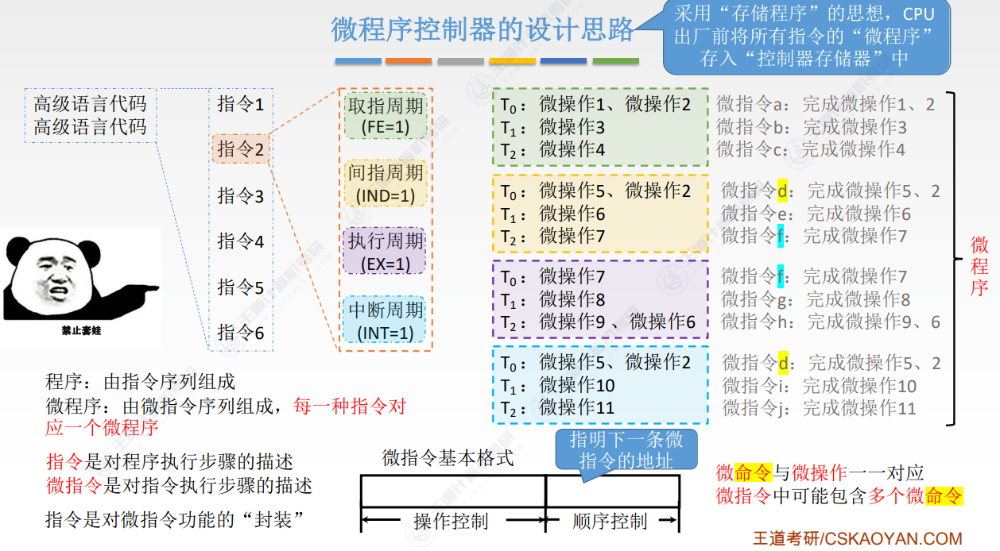

>微程序>微指令>微操作==微命令
>
>微命令与微操作一一对应
>
>一个微指令对应一个微周期

### 5.4控制器功能和工作原理

#### 微程序控制器原理


#### 水平型微指令与垂直型微指令区别

**水平型微指令**

>一位对应一个控制信号对应并行操作
>
>微指令长，编写微程序较麻烦
>
>微程序短，执行速度快

**垂直型微指令**

>微操作码规定微指令的功能，一条指令一种操作
>
>微指令短、简单、规整，便于编写微程序
>
>微程序长，执行速度慢，工作效率低


#### 微指令的地址形成方式


#### 微指令编码方式


### 5.5 异常与中断

#### 轮询与中断对比


#### 程序中断控制流程

用户系统调用 --> 驱动启动设备 -->  操作系统调度-->  设备中断请求--> cpu中断服务 --> cpu恢复运行

相对程序查询方式，它的額外开销是用于进程调度的两次上下文切换时间以及中断服务程序本身的开销

其提高上 I/O效率的前提是这些額外开销小于设备准备时间 ---> 高速设备也可以采用轮询

#### 中断的例子

除数为零、运算溢出、堆栈溢出、程序中断点、打印机缺纸 、 校验错、 定时时间到 、 地址越界、虚存缺页等。

#### 中断的作用

（1）提升并行性：实现CPU和外部设备并行，中断技术使设备准备阶段CPU可以由操作系统调度执行其他任务或进程。
（2）程序调试：方便在程序中设置断点来观察程序执行的中间结果。

（3）故障处理：方便及时处理各种随机出现的软、硬件故障与异常

（4）实时处理：计算机在现场测试和控制、人机对话等应用中都具有很强的实时性，中断
技术的主动告知特性能确保这些应用中的数据被及时处理。
（5）人机交互：如键盘、鼠标等都是通过中断控制方式实现人机对话的，中断技术是多任务操作系统的基础。
（6）实现多任务：进程时间片轮转必须借助定时中断技术实现中断。
（7）多处理器交互：可以通过中断控制方式实现多处理器之间的信息交换和任务切换。

#### 中断分类


CPU在每条指令执行结束后，会主动去检测外部设
周期发出过中断请求

#### 中断优先级

中断优先级就是指CPU响应并处理中断请求的先后次序。

响应优先级和处理优先级。

#### 响应优先级

（1）不可屏蔽中断>内部异常>可屏蔽中断。
（2）内部异常中硬件终止属于最高级，其次是指令异常或自陷等程序故障。（3）DMA中断请求优先于I/O设备传送的中断请求。
（4）在I/0传送类中断请求中，高速设备优先于低速设备，输入设备优先于输出设备，实时控制设备优先于普通设备。

#### 处理优先级

处理优先级是指中断嵌套的实际优先级处理次序，通常可以利用中断屏蔽技术动态调整，从而使低优先级的中断也可以中断高优先级的中断服务程序，使中断处理更加灵活。中断屏蔽寄存器（InterruptMaskRegister，IMR）

#### 先响应优先级，然后 根据处理优先级中断

#### 中断请求的硬件支撑

（1）中断请求寄存器（InterruptRequestRegister，IRR）

IRR的内容又称为中断字。中断处理时，根据中断字确定中断源，然后转入相应的中断服务程序。

（2）中断屏蔽寄存器（InterruptMaskRegister，IMR）

（3）中断服务寄存器（InterruptServiceRegister，ISR）

在Intel8259中断控制器中有两种屏蔽模式，普通屏蔽模式下，当新的中断请求优先级比ISR中存储的最高优先级还高时才能产生新的中断请求送入CPU。这样可以通过屏蔽高优先级中断的方法避免当前中断被高优先级中断打断，但无法实现低优先级中断打断高优先级中断。特殊屏蔽模式下则不判断ISR中的优先级，这样未被屏蔽的中断都可以打断当前中断，可以实现低优先级中断打断高优先级中断。

（4）中断优先级排队电路（PriorityResolver，PR）

（5）中断允许触发器（InterruptEnable/Flag，IE/IF）也称中断使能位、中断标志位


#### 中断响应过程

关中断--保存断点--中断识别

中断响应的过程可以看作由CPU执行中断隐指令完成的，需要占用CPU时间。

注意中断隐指令并不存在，只是一种虚拟的说法，本质上就是硬件的一系列自动操作。

#### 中断号

1. 在向量中断中每一个设备的中断源都有一个唯一的中断编号与之对应，称为中断号

2. 中断号由计算机系统统一分配：通常是固定不变的

3. 对于不同类型的中断源，获取它们的中断号的方法是不同的。

   - 可屏蔽的外部中断的中断号是在中断响应周期内从中断控制器处获取的

   - 系统调用等自陷指令的中断号是由中断指令直接给出的

   - 不可屏蔽中断MI以及异常的中断号则是由系统预先设置好的。

#### 获得中断服务程序入口地址

1. 中断向量：通常将中断服务程序的**入口地址**和**程序状态字**称为中断向量。
2. 中断向量表：中断向量的集合就是中断向量表，简单地说就是中断向量的一维数组
3. 向量地址：用于访问中断向量表中一个表项的地址码，也称为中断指针。
4. 向量中断法的中断响应方式：
   - 先将各个中断服务程序的中断向量组织成中断向量表
   - 中断响应时，通过识别中断源获得中断号，然后计算得到对应于该中断的中断向量地址
   - 再根据向量地址访问中断向量表，从中读出中断服务程序的入口地址和程序状态字PSW，并载入程序计数器PC中和条件状态寄存器中，CPU就可以跳转至中断服务程序了
   - 

#### 中断处理流程


#### DMAC和DMA基本概念

1. 直接内存访问（DirectMemoryAccess，DMA）就是为了减少IO过程中CPU用于实际传输的开销而引入的。
2. 该方式在总线上设置了DMA控制器电路（DMAC），由DMAC临时接管总线代替CPU控制外部设备和内存之间的批量数据交换
3. CPU不再参与实际数据传输过程，数据直接通过系统总线在外部设备和内存之间进行交换
4. 完全消除了程序查询和程序中断控制方式中CPU进行实际数据传输的开销，系统效率得到了巨大提高
5. 无须由CPU寄存器中转。
6. 在DMA传送前CPU需要访问DMAC接口以设置DMA传输参数，具体包括主存地址、数据块长度、传输方向等
7. 然后向设备的I/O接口发送命令和参数来启动设备
8. 传输过程中CPU可以继续执行其他程序，设备需要进行DMA操作时由DMAC向CPU申请总线控制权用于数据传输
9. 一个数据块传送结束后，DMAC会通过中断方式请求CPU对数据缓冲区和DMA控制器进行后处理

#### DMA用途

1. DMA方式主要用于高速设备的块数据传输，常见的磁盘、显卡、网卡、声卡均支持DMA访问，这类设备的数据传输多采用数据块方式。
2. DMA甚至还可以用于内存数据的内部搬移，这种操作经常发生。如果利用CPU程序进行大批量的内存数据搬移，需要经过寄存器中转，会消耗大量的CPU资源采用DMA方式则可以大大提高搬移效率

#### DMA与中断

DMA方式是程序中断传送技术的进一步发展，在传输结束阶段复用了中断技术，它在硬件逻辑机构的支持下，以更快的速度、更简便的形式传送数据，和中断技术存在如下明显的区别。

1. 二者均采用了“请求-应答”机制，但中断技术中请求的是CPU时间，响应的时机是指令周期结束时刻；DMA方式请求的是总线控制权，响应时机是任何一个机器周期结束的时刻
2. 中断技术中通过CPU执行程序进行实际数据传送，存在程序执行现场的保护和恢复问题；而DMA方式依靠额外硬件来实现数据传输，其不改变CPU现场，不影响系统性能。
3. DMA方式仅仅用于数据的传输；而中断技术不仅可以实现数据传输，还可以用于处理各种随机事件，提高计算机的灵活性。

#### DMA与CPU之间内存争用


##### 停止cpu访问内存

这种传送方法的优点是控制简单；缺点是CPU可能较长时间不能访问内存，由于外部设备
与内存速度差异较大，相当一部分内存的工作周期可能会被浪费，内存的效率不能被充分发挥。因此，当外部设备速度与内存速度接近或CPU在DMA期间不访问内存的应用可以采用这种方式。

##### DMAC与CPU交替访问内存

该方式将内存的存取周期分成两段，一段专用于DMAC访问内存，另一段专用于CPU访问内存，这种方式不需要总线使用权的申请、建立和交还等过程，总线使用权是分时控制的；但这种方法会增加内存存储周期，且由于CPU及外部设备的速度与内存不匹配，因此可能有多个供DMA使用的内存时间片被浪费。

##### 周期挪用

周期挪用可能发生在指令周期下任何一个机器周期的结束时刻，DMA操作期间不会修改CPU寄存器，所以没有现场保护的问题。如果挪用周期期间CPU并不访问内存，则这种方式对 CPU的执行没有性能影响：如果挪用周期期间CPU刚好也要访问内存，即形成访存冲突，此时， DMA优先访问内存。周期挪用法已成为DMA传送方式的主要方法。

#### DMA控制器


#### DMA的CPU占比

传输数据块越大，CPU占用率越低。另外，CPU占用率还与数据输速率有关系，传输速率越高，CPU占用率越高。

相比定时查询方式和中断控制方式，DMA 方式大大提升了计算机系统数据传输的效率。

### 5.6指令流水线

#### 流水线的两个表示方式

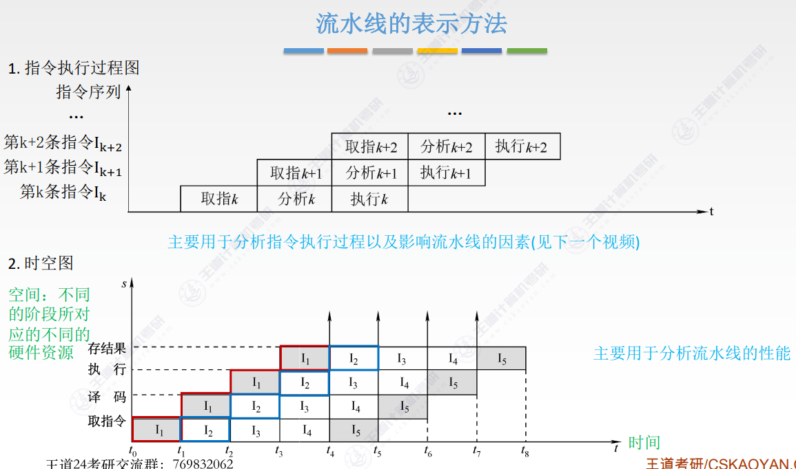

#### 指令流水线的性能指标

##### 吞吐率

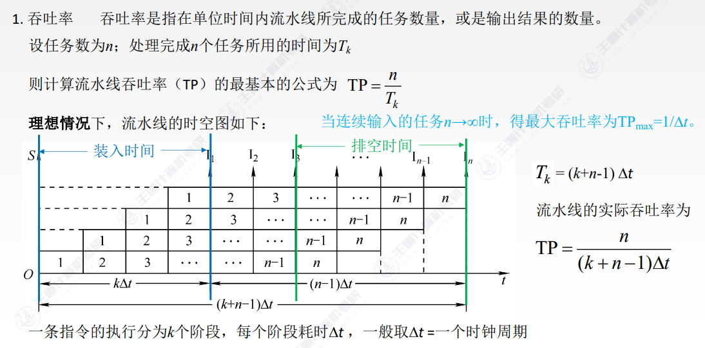
$$
\text{一条指令耗时k个阶段，每个阶段耗时为}{\Delta }{t}\\
\text{那么执行n条纸条消耗的时间为}{(k+n-1)\Delta }{t}\\
\text{吞吐率为执行n条指令除所消耗时间，即}{\frac{n}{{(k+n-1)\Delta }{t}}}
$$

##### 加速比

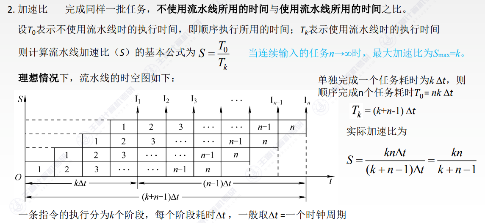
$$
\text{加速比为连续执行n条指令的时间除n条指令的流水线时间，即}{\frac{{kn\Delta }{t}}{{(k+n-1)\Delta }{t}}}
$$


##### 效率

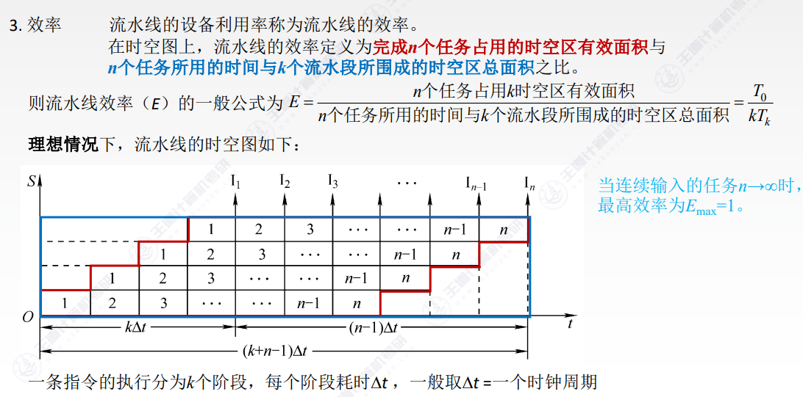
$$
\text{效率为执行n条指令的时间面积除n条指令的流水线时间面积，即}{\frac{{kn\Delta }{t}}{{k(k+n-1)\Delta }{t}}}
$$


#### 流水线冲突的例子

##### 数据相关（Data Hazard）（数据冲突）

>数据相关指在一个程序中，存在必须等前一条指令执行完才能执行后一条指令的情况

>指的是指令执行过程中对数据的依赖关系可能导致的冲突，包括数据读写相关、数据写写相关和数据读读相关。这些相关性可能会导致流水线停顿，降低流水线的效率。下面是一些数据相关的例子：
>
>1. **读后写相关（Read after Write Dependency）**：当一个指令试图读取另一条指令刚刚写入的数据时，就会发生读后写相关。例如：
>
>```assembly
>    mov eax, [addr1]   ; 读取内存地址 addr1 中的数据到寄存器 eax
>    add ebx, eax       ; 将寄存器 eax 的值加到寄存器 ebx 中
>    mov [addr2], ebx   ; 将寄存器 ebx 的值写入内存地址 addr2
>```
>
>在这个例子中，第二条指令依赖于第一条指令的结果。如果第二条指令在第一条指令之前执行，就会读取到错误的数据。
>
>2. **写后读相关（Write after Read Dependency）**：当一个指令试图写入另一条指令刚刚读取的数据时，就会发生写后读相关。例如：
>
>```assembly
>    mov eax, [addr1]   ; 读取内存地址 addr1 中的数据到寄存器 eax
>    mov [addr2], eax   ; 将寄存器 eax 的值写入内存地址 addr2
>    add ebx, eax       ; 将寄存器 eax 的值加到寄存器 ebx 中
>```
>
>在这个例子中，第三条指令依赖于第一条指令的结果。如果第三条指令在第二条指令之前执行，就会读取到错误的数据。
>
>3. **写后写相关（Write after Write Dependency）**：当两条指令试图同时写入相同的数据时，就会发生写后写相关。例如：
>
>```assembly
>    mov [addr], eax    ; 将寄存器 eax 的值写入内存地址 addr
>    mov [addr], ebx    ; 将寄存器 ebx 的值写入内存地址 addr
>```
>
>在这个例子中，第二条指令会覆盖第一条指令的写入结果，可能导致数据不一致性。
>
>这些数据相关性可能会导致流水线停顿，需要等待相关数据可用之后才能继续执行，从而降低了流水线的效率。为了减少数据相关性带来的影响，处理器通常采用技术如数据前瞻（Data Forwarding）和乱序执行（Out-of-Order Execution）等。

##### 结构相关（Structural Hazard）（资源冲突）

>由于多条指令在同一时刻争用同一资源而形成的冲突称为结构相关

>是指在处理器中，由于硬件资源的限制或者竞争，导致无法同时执行多个指令而产生的冲突。这种冲突通常与处理器中的硬件结构有关，包括执行单元、寄存器文件、存储器等。结构相关可能会导致流水线停顿，降低了流水线的效率。
>
>以下是结构相关的一个例子：
>
>```assembly
>    add eax, ebx       ; 将寄存器 eax 和 ebx 中的值相加
>    add ecx, edx       ; 将寄存器 ecx 和 edx 中的值相加
>    mov [addr], eax    ; 将寄存器 eax 的值写入内存地址 addr
>```
>
>在这个例子中，第一条和第二条指令都需要使用算术逻辑单元（ALU）来执行加法运算，而第三条指令则需要使用存储单元来执行内存写入操作。如果处理器中的ALU和存储单元不能同时执行多个操作，就会导致结构相关，从而使得流水线需要在执行第一条或第二条指令时暂停，等待第三条指令完成后再继续执行。
>
>为了减少结构相关带来的影响，现代处理器通常采用了一些技术，比如多发射（Superscalar）和超标量（Out-of-Order Execution）等。这些技术允许处理器在同一个时钟周期内执行多个指令，并且可以在硬件资源竞争时进行动态调度和资源分配，以最大程度地减少结构相关带来的性能损失。
>
>

##### 控制相关（Control Hazard）（控制冲突）

>当流水线遇到转移指令和其他改变PC值的指令而造成断流时，会引起控制相关。

>控制相关是指由于程序中的分支或跳转指令（如条件分支、无条件分支、函数调用等）导致的流水线中断。控制相关会对流水线的效率产生影响，因为分支指令的执行取决于之前指令的结果，而处理器可能在分支指令的执行前已经取出并开始执行后续指令。
>
>举例来说明控制相关：
>
>```assembly
>    cmp eax, ebx       ; 比较 eax 和 ebx 的值
>    jg  greater        ; 如果 eax 大于 ebx，则跳转到 greater 标签处
>    add ecx, edx       ; 如果比较失败，则执行这条指令
>greater:
>    sub esi, edi       ; greater 标签处的指令
>```
>
>在这个例子中，如果分支预测成功，即 `jg` 指令正确预测到了条件成立，那么流水线可以顺利执行；但如果分支预测失败，即 `jg` 指令预测错误，处理器必须丢弃已经取出的 `add ecx, edx` 指令的结果，并重新开始执行 `jg` 指令之后的指令，导致流水线中断和清空。
>
>为了减少控制相关对流水线的影响，现代处理器采用了一些技术，如分支预测、分支目标缓存、延迟分支执行、静态分支预测等。这些技术旨在尽可能准确地预测分支的执行结果，以减少流水线的停顿和清空，从而提高处理器的执行效率。

#### 流水线冲突的解决办法

##### 结构相关

>1.后一相关指令暂停一周期 
>
>2.资源重复配置： 数据存储器+指令存储器

##### 数据相关

>1.把遇到数据相关的指令及 其后续指令都暂停一至几个时钟周期，直到数据相关问 题消失后再继续执行。可分为硬件阻塞(stall)和软件插 入“NOP”两种方法。 
>
>2.数据旁路技术（转发技术）。 
>
>3.编译优化：通过编译器调 整指令顺序来解决数据相关

##### 控制相关

>1.转移指令分支预测。简单预测（永远猜ture或false）、动态预测（根据历史情况动态调整） 
>
>2.预取转移成功和不成功两个控制流 方向上的目标指令 
>
>3.加快和提前形成条件码 
>
>4.提高转移方向的猜准率

#### 流水线的多发技术

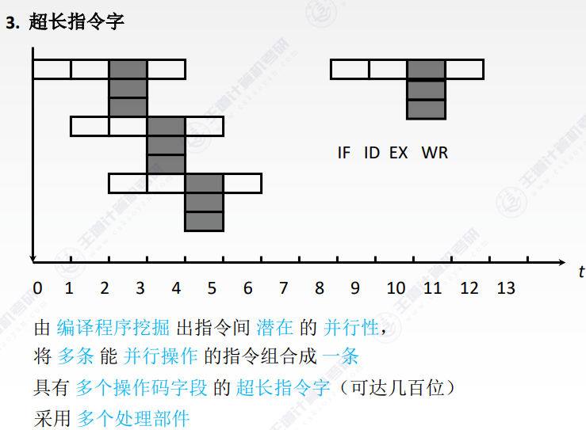

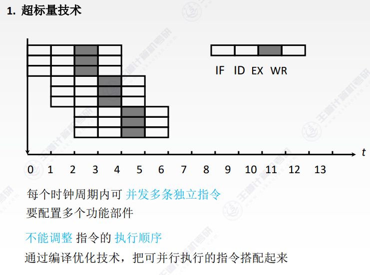

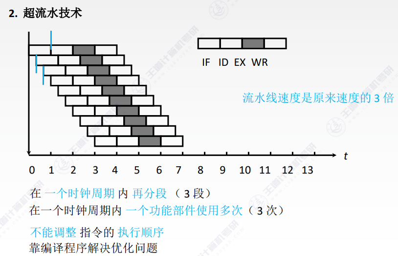

>超流水线技术，时分复用
>
>超标量技术，空分复用
>

#### 五段式流水线

>取指，译码，执行，访存，回写

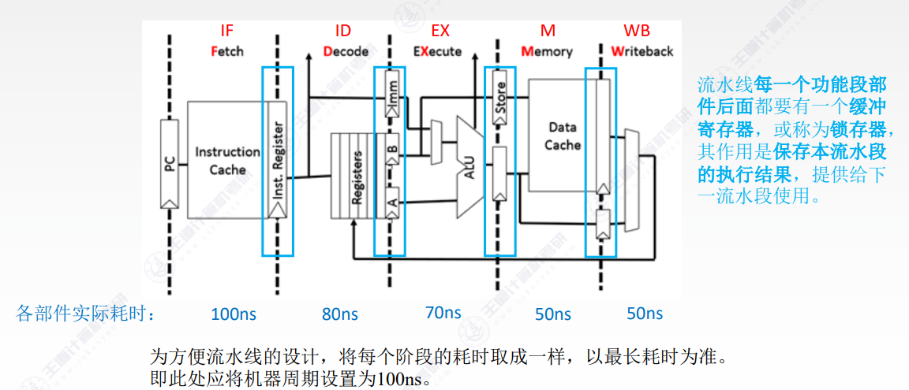

>流水线每一个功能段部件后面都要有一个缓冲寄存器，或称为锁存器， 
>
>其作用是保存本流水段 的执行结果，提供给下 一流水段使用

>为方便流水线的设计，将每个阶段的耗时取成一样，以最长耗时为准

>只有上一条指令进入ID段后，下一条指令才能开始IF段，否则会覆盖IF段锁存器的内容

#### 四个指令的过程

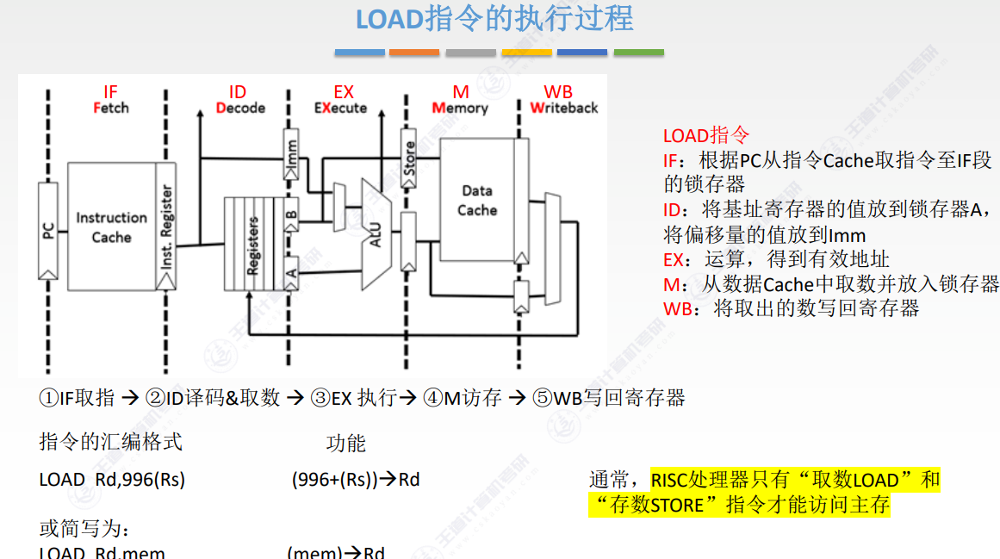

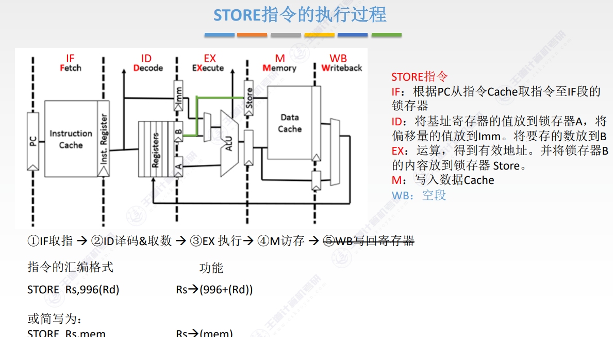

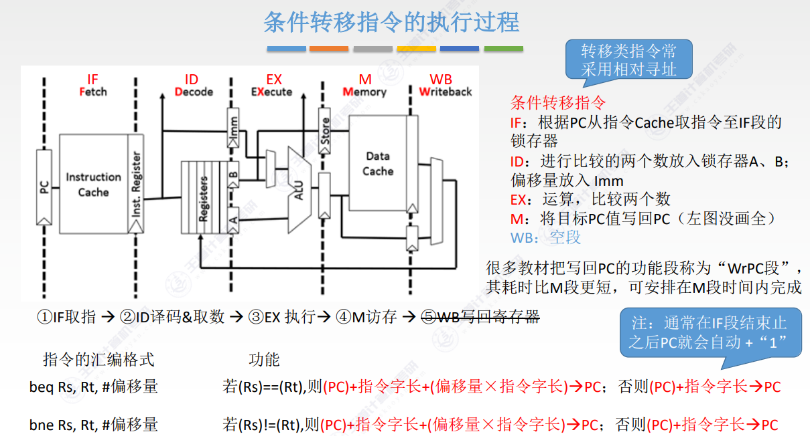

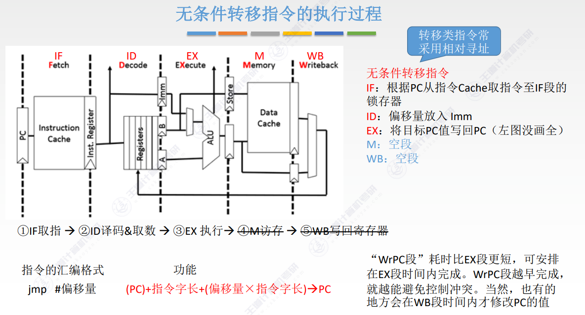

RISC和流水线

>RISC一定采用流水线技术，采用流水线技术的不一定是RISC

### 5.7 多处理器基本概念

# 6.总线周期

### 6.1总线概述 

#### 串并行线速度问题：

>**并行总线通常比串行总线传输速率快，但这不是绝对的。**
>
>在时钟频率较低的情况下，并行总线因为可以同时传输若干比特，速率确实比串行总线快。但是，随着技术的发展，时钟频率越来越高，并行总线之间的相互干扰越来越严重，当时钟频率提高到一定程度时，传输的数据已无法恢复。而串行总线因为导线少，线间干扰容易控制，反而可通过不断提高时钟频率来提高传输速率

>**为何串行总线取代并行总线:**
>**并行总线:**
>
>​	用m根线每次传送m个比特，用高/低电平表示1/0，通常采用同步定时方	式，由于线间信号干扰，因此总线工作频率不能太高。
>
>​	另外，各条线不能有长度差，长距离并行传输时工艺难度大。
>**串行总线:**
>
>​	用两根线每次传送一个比特，采用“差模信号”表示1/0，通常采用异步定	时方式，总线工作频率可以很高。
>
>​	现在的串行总线通常基于包传输，如80bit为一个数据包，包与包之间有	先后关系，因此可以用多个数据通路分别串行传输多个数据包。
>
>​	因此某种程度上现在的串行总线也有“并行”的特点

#### 总线复用：

>总线复用是指一种信号线在不同的时间传输不同的信息,它可使用**较少的线路**传输**更多的信息**，从而**节省空间和成本**

>**同步总线:**
>
>​	它采用**公共的时钟信号**进行定时。
>
>​	挂接在总线上的所有设备都从时钟线上获得定时信号。
>**同步通信方式两个缺点:**
>
>​	第一，总线定时**以最慢设备所花时间为标准**，所以同步总线适合于存取 		**时间相差不大**的多个功能部件之间的通信;
>
>​	第二，由于时钟偏移问题，导致**同步总线不能过长**， 实现更快传送速		度、更长传输线的总线时，会导致传送到另一端时的波形发生变		形，从而导致所有位中最快和最慢的位信号之间的时间偏差较大。
>**异步串行方式进行传输:**
>
>​	串行总线每次在**一根信号线**上传送数据位，
>
>​	**传输速率可以比并行总线高得多**，通过多个数据通道的组合，
>
>​	可以实现比传统并行总线**高得多的数据传输带宽**。
>
>**同步和异步区别：**
>
>
>
>

#### 总线性能指标：

>1.总线的传输周期(总线周期)
>
>​	一次总线操作所需的时间
>
>​	(包括**申请阶段、寻址阶段、传输阶段和结束阶段**)
>
>​	通常由若干个总线时钟周期构成。
>
>2.总线时钟周期
>	即**机器的时钟周期**。
>
>​	计算机有一个统一的时钟，以控制整个计算机的各个部件，总线也要受	此时钟的控制。
>
>3.总线的工作频率(hz)
>
>​	总线上各种操作的频率，为总线周期的倒数。
>
>​	实际上指一秒内传送几次数据
>
>4.总线的时钟频率
>
>​	即机器的时钟频率，为时钟周期的倒数。
>
>​	实际上指一秒内有多少个时钟周期
>5.总线宽度
>​	又称为总线位宽，它是总线上同时能够传输的数据位数，
>
>​	通常是指数据总线的根数，如32根称为32位(bit)总线。
>
>**6.总线带宽**
>$$
>总线带宽=总线工作频率*总线宽度(bit/s)=总线工作频率*(总线宽度/8)(B/s)
>$$
>​	可理解为**总线的数据传输率**，即单位时间内总线上可传输数据的位数，	通常用**每秒钟**传送信息的**字节数**来衡量。
>​	单位可用**字节/秒(B/s)**表示。
>
>​	**总线带宽是指总线本身所能达到的最高传输速率。**
>​	在计算实际的**有效数据传输率**时，要用**实际传输的数据量**除以耗时
>
>
>
>7.总线复用
>	总线复用是指一种信号线在不同的时间传输不同的信息。
>
>​	可以使用较少的线传输更多的信息，从而节省了空间和成本。
>8.信号线数
>​	地址总线、数据总线和控制总线3种总线数的总和称为信号线数

### 6.2总线事务

#### 总线传输时间

>$$
>\text{总线传输时间}=传输地址+准备数据+传输数据
>$$

>`突发传送`：
>
>​	传送连续数据，省略每个地址，只传送一次首地址
>
>​	是指在一个总线周期中，可以传输多个存储地址连续的数据，	
>
>​	即一次传输一个地址和一批地址连续的数据
>
>例如下面这题是29ns


#### 总线特点

>
>

#### 总线功能分类

>
>
>

#### 系统总线结构

>
>
>分为单总线，双总线，三总线，四总线
>
>
>
>
>
>
>
>
>
>`补充:1.桥接器:用于连接不同的总线，具有数据缓冲、转换和控制功能。2.靠近CPU的总线速度较快。`

#### 总线周期

>
>

>$$
>总线传输周期=寻址阶段+申请分配阶段+传输阶段
>$$


>00E080 1110 0000 1000 0000
>
>003820 0011 1000 0010 0000
>
>
