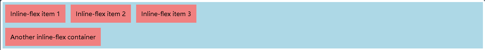
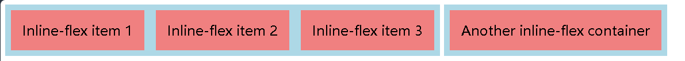

### 视频

[1-9 django的模板语法_哔哩哔哩_bilibili](https://www.bilibili.com/video/BV1NL41157ph?p=10&vd_source=81d07727a431bd6b2d07b94e67a294fc)

## 创建项目

### cmd

```py
mkdir django_intro
django-admin startproject test1
```

### Pycharm

#### 查看pytho安装路径

```py
py -0p 
C:\Users\Lenovo\AppData\Local\Programs\Python\Python311\Scripts>
```

打开终端

Alt+F12

#### 创建app

```py
python manage.py startapp [app的名字]
```

#### 命令行启动

```py
pytho n manage.py runserver
```

## Diango框架

>urls.py-->views.py-->templates(html)
>
>​	views.py的render函数替换(html)文件
>
>urls.py<--views.py<--templates
>
>​	urls.py把修改完的(html)数据传给浏览器

### static文件

配置bootstrap和js文件

### templates文件

配置html网页的文件

### views.py

写具体做的事

```py
from django.shortcuts import render,HttpResponse,redirect

# Create your views here.
def index(request):
    return HttpResponse("欢迎使用")
def user_list(request):
    return render(request,"user_list.html")

def tpl(request):
    name = "hanmeimei"
    roles = ['liming','wangxiaoqing','shenteng']
    return render(request,"tpl.html",{"n1":name,"n2":roles})


```

### urls.py

把网址的路径和views函数对应起来

```py
urlpatterns = [
    # path("admin/", admin.site.urls),
    path('user/list',views.user_list),
    path('index/',views.index),
    path('user/add',views.user_add),
    path('tpl/',views.tpl),
    path('something/',views.something),
]
```

### 链接数据库

用ORM库，用函数替代sql

#### 终端执行，安装mysql客户端

```py
python.exe -m pip install --upgrade pip

pip install mysqlclient
```

#### mysql常用cmd指令

```md
mysql常用sql语句，查看库：show databases
1、查看库：show databases;
2、建立数据库： create database 库名;
3、选择数据库：use 库名;
4、查看库下的所有表：show tables;
5、查看表结构 ：desc表名;(describe缩写)
6、建立数据表：
use 库名;
create table 表名 (字段名 varchar(20)字符串， 字段名 char(1));
7、修改表名：rename table oldname to newname;
8、往表中插入记录：insert into 表名values (‘hyq’，‘m’);
9、显示表中的记录：select * from 表名;
10、更新表中数据：
update 表名 set 字段名1=‘a’, 字段名2=‘b’ where 字段名3=‘c’;
多个字段更新，用逗号隔开
自增 update myTable set vipczz=vipczz+1 where vip=1;
11、将表中记录清空：delete from表名 where id=1;
12、删除数据表：drop table 表名；
13、删除数据库：drop database 库名;
```

myini

>[mysqld]
>explicit_defaults_for_timestamp=true
>#设置3306端口号
>port=3306
>#设置MySQL的安装目录
>basedir=E:\\mysql-5.7.44-winx64
>#设置MySQL数据库的数据存放目录
>datadir=E:\\mysql-5.7.44-winx64\\data(与上面同理，注意最后的data文件名保存不变)
>#运行最大连接数
>max_connections=200
>#运行连接失败的次数。这也是为了防止有人从该主机试图攻击数据库系统
>max_connect_errors=10
>#服务端使用的字符集默认为utf-8
>character-set-server=utf8
>skip-grant-tables
>[mysql]
>#客户端使用的字符集默认为utf8
>default-character-set=utf8
>[client]
>#客户端默认端口号为3306
>port=3306
>show_compatibility_56 = ON
>performance_schema
>
>

#### 登入

mysqld.exe --install mysql --denfaults-file=E:\mysql-5.7.44-winx64\bin\my.ini

```cmd
mysql -u root -p
```

查看配置文件位置

```c
select @@basedir;
```


#### 创建数据库

```cmd
 reate database django;
```

#### settings.py数据库配置

```py
DATABASES = {
    'default': {
        'ENGINE': 'django.db.backends.mysql',
        'NAME': 'blog',
    'USER':'root',
    'PASSWORD':'223663',
    'HOST':'127.0.0.1',
    'PORT':'3306',
    }
}
```

#### Django操作表

##### app02下models.py文件写一个类配置表格

```py
from django.db import models
class UserInfo(models.Model):
    name = models.CharField(max_length=32)
    password = models.CharField(max_length=32)
    age = models.CharField(max_length=32)
```

#### 终端执行命令,去创建表格

```cmd
python manage.py makemigrations
python manage.py migrate
```

### 添加用户

templates下

一定要添加`  `,提交的时候

```html
<!DOCTYPE html>
<html lang="en">
<head>
    <meta charset="UTF-8">
    <title>Title</title>
</head>
<body>
<h1>ADD USERS</h1>

<a href="/info/add/">添加</a>
<form method="post" action="/info/add/">
    
    <input type="text" name="user" placeholder="user name">
    <input type="text" name="pwd" placeholder="pwd">
    <input type="text" name="age" placeholder="age">
    <input type="submit" value="submit" >
</form>
</body>
</html>
```

views.py下

```py
def info_add(request):
    if request.method == "GET":
        return render(request,"info_add.html")
    user = request.POST.get("user")
    pwd = request.POST.get("pwd")
    age = request.POST.get("age")

    UserInfo.objects.create(name=user,password=pwd,age=age)

    return redirect("http://127.0.0.1:8000/info/list")
```

### 删除用户

views.py下

```python
def info_delete(request):
   nid = request.GET.get('nid')
   UserInfo.objects.filter(id=nid).delete()
   return HttpResponse("DELETE SUCCESS")
```

html

```html
<!DOCTYPE html>
<html lang="en">
<head>
    <meta charset="UTF-8">
    <title>Title</title>
</head>
<body>
<h1>ADD USERS</h1>


<form method="post" action="/info/add/">
    
    <input type="text" name="user" placeholder="user name">
    <input type="text" name="pwd" placeholder="pwd">
    <input type="text" name="age" placeholder="age">
    <input type="submit" value="submit" >
</form>
</body>
</html>
```

## 员工项目

### 创建项目

工具里 直接使用stratapp app01

### 设计models.py

#### 添加外键

to哪个表关联，to_fields哪个列关联

```py
    depart = models.ForeignKey(to="Department",to_fields="id",on_delete=models.CASCADE())
    depart = models.ForeignKey(to="Department",to_fields="id",null=True,blank=True,on_delete=models.SET_NULL)

```

名字自动生成_id,要添加级联删除，允许为空

#### 添加固定表

```python
#固定变量
gender_choices=(
    (1,"男"),
    (2,"女"),
)
gender = models.SmallIntegerField(verbose_name="性别",choices=gender_choices)
```

### 创建数据库

```py
create database staff DEFAULT CHARSET utf8 COLLATE utf8_general_ci;
```

#### 配置数据库

```py
DATABASES = {
    'default': {
        'ENGINE': 'django.db.backends.mysql',
        'NAME': 'staff',
    'USER':'root',
    'PASSWORD':'223663',
    'HOST':'127.0.0.1',
    'PORT':'3306',
    }
}
```

#### 更改mysql加密方式

```py
alter user 'root'@'localhost' identified with mysql_native_password by '223663';
```

#### python终端

```py
 makemigrations
```

#### 全局搜索函数 check_database_version_supported()删除


<p>
    <code>&lt;header&gt;</code> 作为内联元素被包围。</p>
<p>如果需要把代码显示为一个独立的块元素，请使用 &lt;pre&gt; 标签：</p>
<pre>
    &lt;article&gt;
        &lt;h1&gt;Article Heading&lt;/h1&gt;
    &lt;/article&gt;
</pre>


> html文件启动
>
> 右键

### a标签的hover

鼠标放到文字就变化

### display

#### display: block;


#### display: inline;


#### display: inline-block;


#### display: flex;



#### display: inline-flex;



#### display: grid;


#### display: inline-grid;


#### display: flow-root;


 https://i1.mifile.cn/f/i/2014/cn/placeholder-40.png

### iconfont矢量图

[javascript - iconfont的使用方法(更新了一些内容） - 个人文章 - SegmentFault 思否](https://segmentfault.com/a/1190000016235900#item-1)

#### 使用方法

三种方式：unicode，symbol，和icon-xxx，官方文档有步骤

第三种方式，下载文件，放在html周围的文件夹，加一句话就可以在html用图标了

```html
<link rel="stylesheet"href="./font_5274h12vkj5/iconfont.css">

```

**iconfront.css**规定了图标的大小之类的信息，样式信息


哪里需要用就用下面这个代码

```html
    <div class="test-icofont">
        <i class="iconfont icon-shuju-wenjianliebiao">sss</i>
    </div>
```

### 小米商城半代码

```html
<!DOCTYPE html>

<html lang="en">

<head>

    <meta charset="UTF-8">

  <title>Title</title>

  <link rel="stylesheet"href="./font_5274h12vkj5/iconfont.css">

    <style>

​    body {

​      margin: 0;

​    }

​    img {

​      width: 100%;

​      height: 100%;

​    }

​    .left {

​      float: left;

​    }

​    .container {

​      width: 1226px;

​      margin: 0 auto;

​    }

​    .header {

​      background: #333;

​    }

​    .header .menu {

​      float: left;

​      color: white;

​    }

​    .header .account {

​      float: right;

​      color: white;

​    }

​    .header a {

​      color: #b0b0b0;

​      line-height: 40px;

​      display: inline-block;

​      font-size: 12px;

​      margin-right: 10px;

​      text-decoration: none;

​    }

​    .header a:hover {

​      color: white;

​    }

​    .sub-header {

​      height: 100px;

​    }

​    .sub-header .ht {

​      height: 100px;

​    }

​    .sub-header .logo {

​      width: 234px;

​      float: left;

​    }

​    .sub-header .logo a {

​      margin-top: 22px;

​      display: inline-block

​    }

​    .sub-header .logo a img {

​      height: 56px;

​      width: 56px;

​    }

​    .sub-header .menu-list {

​      float: left;

​      line-height: 100px;

​    }

​    .sub-header .menu-list a {

​      display: inline-block;

​      padding: 0 10px;

​      color: #333;

​      font-size: 16px;

​      text-decoration: none;

​    }

​    .sub-header .menu-list a:hover {

​      color: #ff6700;

​    }

​    .sub-header .search {

​      float: right;

​    }

​    .slider .sd-img {

​      width: 1226px;

​      height: 460px;

​    }

​    .news{

​      margin-top: 14px;

​    }

​    .news .channel {

​      width: 228px;

​      height: 164px;

​      background-color: #5f5750;

​      padding: 3px;

​    }

​    .news .channel .item {

​      height: 82px;

​      width: 76px;

​      float: left;

​      text-align: center;

​    }

​    .news .channel .item a{

​      display: inline-block;

​      font-size: 12px;

​      padding-top: 18px;

​      color: #fff;

​      text-decoration: none;

​      opacity: 0.7;

​    }

​    .news .channel .item a:hover{

​      opacity: 1;

​    }

​    .news .channel .item  img{

​      height: 24px;

​      width: 24px;

​      display: block;

​      margin: 0 auto 4px;

​    }

​    .news .list-item {

​      width: 316px;

​      height: 170px;

​    }

  </style>

</head>

<body>

<div class="header">

    <div class="container">

        <div class="menu">

​            <a href="https://www.mi.com/">小米商城</a>

​            <a href="https://www.mi.com/">MIUI</a>

​            <a href="https://www.mi.com/">云服务</a>

​            <a href="https://www.mi.com/">有品</a>

​            <a href="https://www.mi.com/">开放平台</a>

​    </div>

        <div class="account">

​            <a href="https://www.mi.com/">登录</a>

​            <a href="https://www.mi.com/">注册</a>

​            <a href="https://www.mi.com/">消息通知</a>

​    </div>

        <div style="clear: both"></div>

  </div>

</div>

<div class="sub-header">

    <div class="container">

        <div class="ht logo">

​      <!-- a，行内标签；默认设置高度、边距无效。 -> 块级 & 行内+块级 -->

​            <a href="https://www.mi.com/">

​                

​      </a>

​    </div>

        <div class="ht menu-list">

​            <a href="https://www.mi.com/">Xiaomi手机</a>

​            <a href="https://www.mi.com/">Redmi红米</a>

​            <a href="https://www.mi.com/">电视</a>

​            <a href="https://www.mi.com/">笔记本</a>

​            <a href="https://www.mi.com/">平板</a>

​    </div>

        <div class="ht search"></div>

        <div class="clear:both;"></div>

  </div>

</div>

<div class="slider">

    <div class="container">

        <div class="sd-img">

​            

​    </div>

  </div>

</div>

<div class="news">

    <div class="container">

        <div class="channel left">

            <div class="item">

​                <a href="https://www.mi.com/">

​          <i class="iconfont icon-shuju-wenjianliebiao"></i>

​          <span>保障服务</span>

​        </a>

​      </div>

           <div class="item">

​                <a href="https://www.mi.com/">

​          <i class="iconfont icon-shuju-wenjianliebiao"></i>

​          <span>保障服务</span>

​        </a>

​      </div>

            <div class="item">

​                <a href="https://www.mi.com/">

​          <i class="iconfont icon-shuju-wenjianliebiao"></i>

​          <span>保障服务</span>

​        </a>

​      </div>

            <div class="item">

​                <a href="https://www.mi.com/">

​          <i class="iconfont icon-shuju-wenjianliebiao"></i>

​          <span>保障服务</span>

​        </a>

​      </div>

            <div class="item">

​                <a href="https://www.mi.com/">

​          <i class="iconfont icon-shuju-wenjianliebiao"></i>

​          <span>保障服务</span>

​        </a>

​      </div>

            <div class="item">

​                <a href="https://www.mi.com/">

​          <i class="iconfont icon-shuju-wenjianliebiao"></i>

​          <span>保障服务</span>

​        </a>

​      </div>

            <div class="clear:both"></div>

​    </div>

        <div class="list-item left" style="margin-left: 14px">

​            

​    </div>

        <div class="list-item left" style="margin-left: 15px">

​            

​    </div>

        <div class="list-item left" style="margin-left: 15px">

​            

​    </div>

        <div class="clear:both"></div>

  </div>

</div>

</body>

</html>


```


### 两个图的绝对位置和相对位置

```html
<!DOCTYPE html>
<html lang="en">
<head>
    <meta charset="UTF-8">
    <title>Title</title>
    <style>

        .c1{
            height: 300px;
            width: 500px;
            border: 1px solid red;
            margin: 100px;

           
        }
        .c1 .c2{
            height: 59px;
            width: 59px;
            background-color: #00FF7F;

            position: relative;
            top: 40px; left: 40px;
            
        }
    </style>
</head>
<body>
    <div class="c1">

        <div class="c2"></div>

    </div>
</body>
</html>
```

